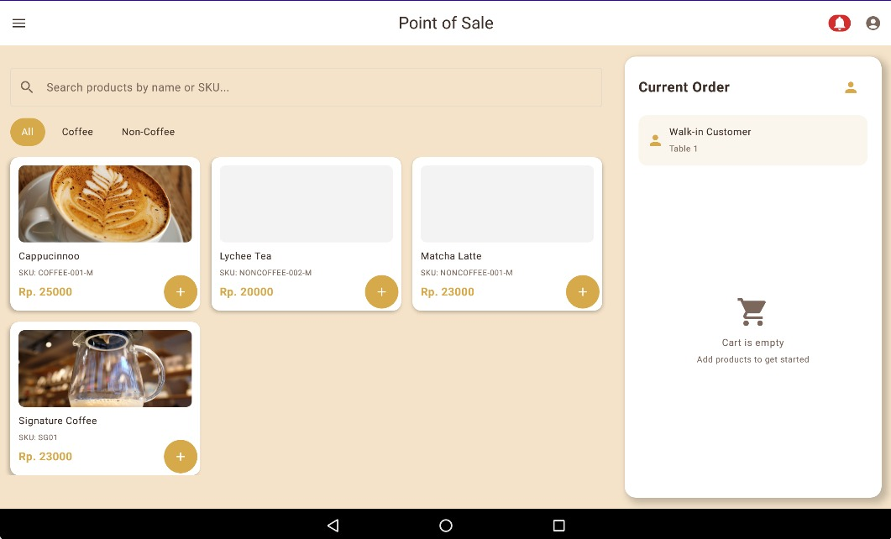
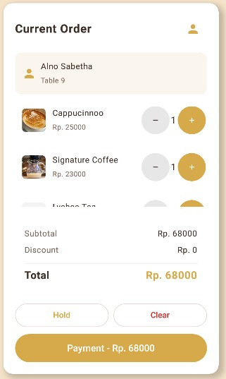
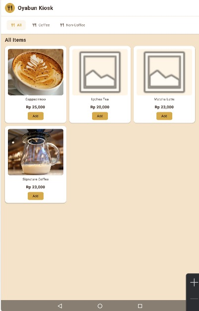
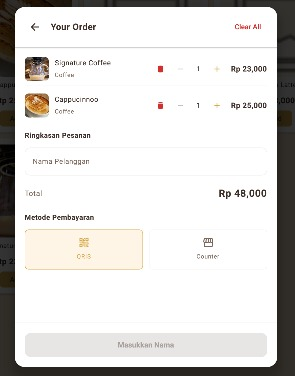
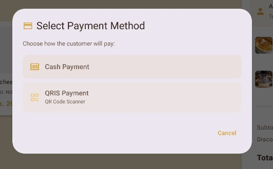
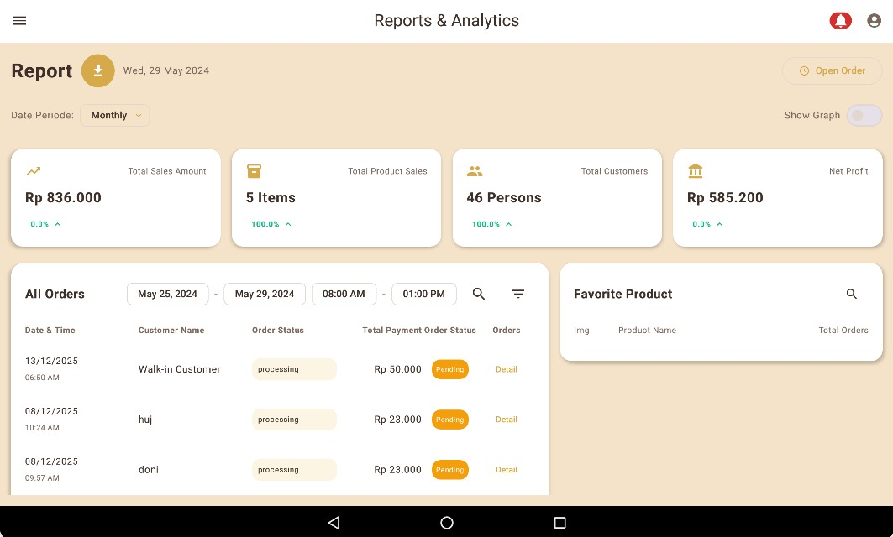
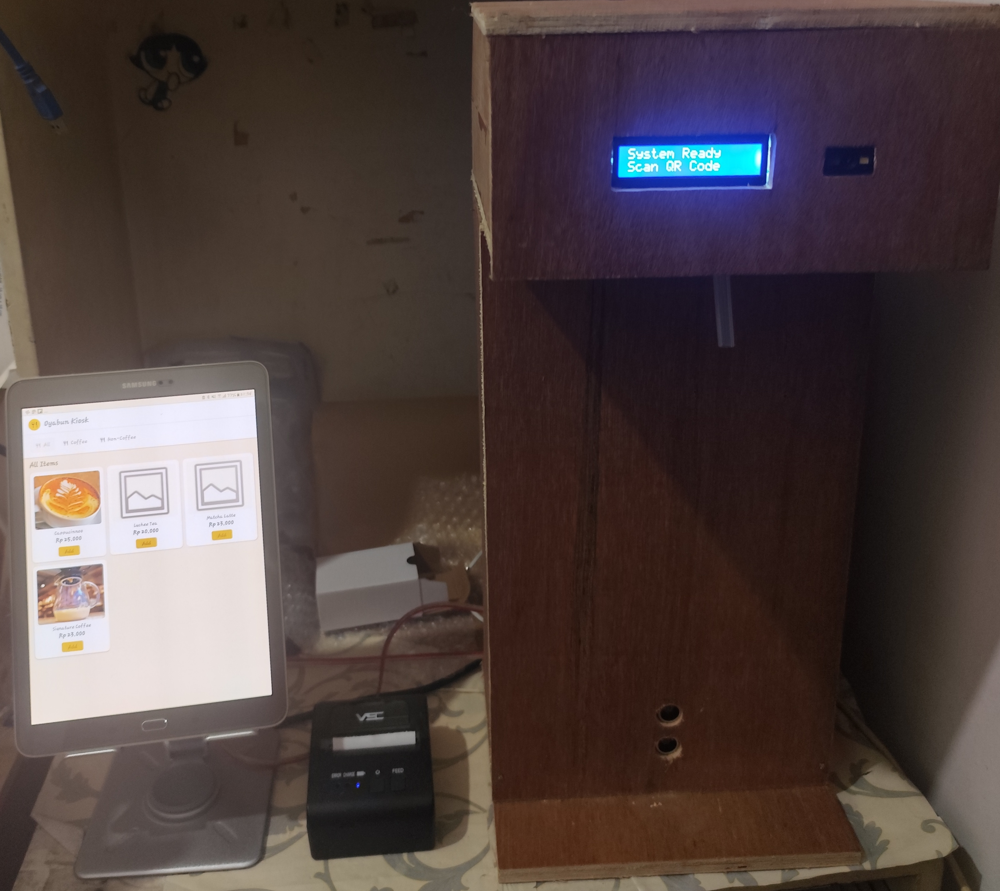

# 🍽️ F&B Complete Automation System

> End-to-end restaurant automation system with microservices, mobile apps, and IoT integration


---

## 📋 Overview

A complete coffeeshop automation system consisting of three integrated subsystems:

1. **POS System** - Staff tablet app for orders, payments, products, and analytics
2. **Self-Service Kiosk** - Customer-facing ordering terminal with Bluetooth printing
3. **Smart Dispenser** - IoT beverage dispenser with QR validation and LCD display

**System Status**: Functional MVP running on Docker (local development)

---

## 🎬 Demo

🎥 **[Watch Full System Demo on YouTube]TBA**

### Screenshots

<table>
  <tr>
    <td colspan="2"><b>POS System</b></td>
    <td colspan="2"><b>Kiosk</b></td>
  </tr>
  <tr>
    <td><br/><sub>Order Dashboard</sub></td>
    <td><br/><sub>Create Order</sub></td>
    <td><br/><sub>Menu Browser</sub></td>
    <td><br/><sub>Checkout</sub></td>
  </tr>
  <tr>
    <td><br/><sub>Payment</sub></td>
    <td><br/><sub>Analytics View</sub></td>
    <td colspan="2"><br/><sub>Smart Dispenser with LCD</sub></td>
  </tr>
</table>

---

## 🏗️ System Architecture

```
┌──────────────────┐  ┌──────────────────┐  ┌──────────────────┐
│   POS Tablet     │  │  Kiosk Tablet    │  │   Dispenser      │
│   (Jetpack       │  │  (Jetpack        │  │   (ESP32 +       │
│    Compose)      │  │   Compose)       │  │   LCD Display)   │
│                  │  │                  │  │                  │
│  • Orders        │  │  • Self-Service  │  │  • QR Scanning   │
│  • Payments      │  │  • Menu Browse   │  │  • Validation    │
│  • Products      │  │  • BT Printing   │  │  • Dispensing    │
│  • Analytics     │  │  • Idle Screen   │  │  • LCD Status    │
│  • BT Printing   │  │                  │  │                  │
└────────┬─────────┘  └────────┬─────────┘  └────────┬─────────┘
         │                     │                      │
         └─────────────────────┼──────────────────────┘
                               │
                      Direct API Calls
                               │
         ┌─────────────────────┼─────────────────────┐
         │                     │                     │
         │         RabbitMQ Message Queue            │
         │         (Event-Driven Communication)      │
         │                     │                     │
    ┌────▼─────┐  ┌────────────▼──┐  ┌──────────────▼───┐
    │  Order   │  │   Payment     │  │    Product       │
    │ Service  │  │   Service     │  │    Service       │
    │  (.NET)  │  │    (.NET)     │  │    (.NET)        │
    └────┬─────┘  └───────┬───────┘  └────────┬─────────┘
         │                │                    │
    ┌────▼──────┐  ┌──────▼───────┐  ┌────────▼─────────┐
    │ Inventory │  │      QR      │  │    Analytics     │
    │  Service  │  │   Service    │  │    Service       │
    │  (.NET)   │  │    (.NET)    │  │   (FastAPI)      │
    └────┬──────┘  └──────┬───────┘  └────────┬─────────┘
         │                │                    │
         │                │                    │
    ┌────▼────────────────▼────────┐  ┌────────▼─────────┐
    │       PostgreSQL             │  │   ClickHouse     │
    │  (Transactional Database)    │  │   (Analytics)    │
    │                              │  │                  │
    │  • orders_db                 │  │  • sales_fact    │
    │  • payments_db               │  │  • product_perf  │
    │  • products_db               │  │  • inventory_log │
    │  • inventory_db              │  │                  │
    │  • qr_db                     │  │                  │
    └──────────────────────────────┘  └──────────────────┘
                   │
            ┌──────▼──────┐
            │    Redis    │
            │  (Caching)  │
            │             │
            │  • Product  │
            │    prices   │
            │  • isDisp.  │
            │    flags    │
            └─────────────┘

All services containerized with Docker
Running on Docker Compose (local dev)
```

**[📄 Detailed Architecture Documentation](docs/architecture/system-architecture.md)**

---

## 🛠️ Tech Stack

### Backend Microservices (6 Services)
```yaml
Framework:        .NET 8 (C#) - 5 services
                  FastAPI (Python) - Analytics
API Pattern:      RESTful APIs (direct calls, no API Gateway yet)
Messaging:        RabbitMQ (Event-driven for async operations)
Database:         PostgreSQL (ACID compliance)
                  └─ Separate DB per service
Analytics DB:     ClickHouse (Columnar OLAP)
Caching:          Redis (Order Service only)
                  └─ Product prices
                  └─ isDispensable flags
Containerization: Docker + Docker Compose
Deployment:       Local development environment
```

### Mobile Applications (2 Apps)
```yaml
Platform:         Android Tablet
Language:         Kotlin
UI Framework:     Jetpack Compose
Architecture:     MVVM + Clean Architecture
DI:               Hilt / Koin
Networking:       Retrofit + OkHttp
Local Storage:    Room (SQLite)
Printer:          Bluetooth Thermal Printer
Design:           Material Design 3
Offline Mode:     Not yet implemented
```

### IoT Hardware (1 Device)
```yaml
Microcontroller:  ESP32-WROOM-32
QR Scanner:       GM65 2D Barcode Module (UART)
Pump:             12V Diaphragm Pump (Generic)
Pump Control:     Relay Module
Display:          LCD Module (I2C/Parallel)
                  └─ Shows: Idle, Scanning, 
                            Dispensing, Error states
Communication:    WiFi (Direct HTTP to QR Service)
Framework:        Arduino / PlatformIO
Power:            12V adapter + buck converter (5V)
```

---

## ✨ Key Features

### 🖥️ POS System (All-in-One)
- ✅ **Order Management** - Create, view, manage orders
- ✅ **Payment Processing** - Multiple payment methods
- ✅ **Product Management** - Browse and manage catalog
- ✅ **Analytics Dashboard** - Real-time metrics (dedicated menu)
- ✅ **Receipt Printing** - Bluetooth thermal printer
- ✅ **QR Generation** - For dispensable beverages
- ⏳ **Offline Mode** - Planned for future

### 📱 Self-Service Kiosk
- ✅ **Touch-Optimized UI** - Large buttons, easy navigation
- ✅ **Menu Browsing** - Category filtering
- ✅ **Cart Management** - Add, remove, adjust quantities
- ✅ **Mock Payment Flow** - Payment simulation (prototype)
- ✅ **Bluetooth Printing** - Receipt with QR code
- ⏳ **Real Payment Integration** - Planned
- ⏳ **Multi-language** - Planned

### 🤖 Smart Dispenser (ESP32)
- ✅ **QR Code Scanning** - GM65 2D scanner via UART
- ✅ **Real-time API Validation** - Direct WiFi call to QR Service
- ✅ **LCD Status Display** - Current operation status
  - "IDLE - Scan QR"
  - "Validating..."
  - "Dispensing... Xsec"
  - "Complete!"
- ✅ **Precision Dispensing** - Relay-controlled pump
- ✅ **Usage Logging** - Track via QR Service

### 📊 Analytics (Integrated in POS)
- ✅ **Real-time Dashboard** - Sales, orders, revenue
- ✅ **Product Performance** - Popular items, trends
- ✅ **Fast OLAP Queries** - ClickHouse backend
- ✅ **ETL Pipeline** - Automated sync (FastAPI)
- ⏳ **Advanced Reporting** - Planned

---

## 🧩 Microservices Detail

### 1. Order Service (.NET)
**Port**: 5001  
**Database**: PostgreSQL (`orders_db`)

**Responsibilities:**
- Order CRUD operations
- Order status management (Pending → Paid → Completed)
- Integration with Product, Inventory, Payment services
- Event publishing to RabbitMQ on order completion

**Redis Cache Usage:**
- Product prices (TTL: 5 min) - reduces Product Service calls
- `isDispensable` flags - determines QR generation need

**Key Endpoints:**
```
GET    /api/Order/          - Get order details
POST   /api/Order           - Create order
GET    /api/Order/{OrderId} - Get order by id
```

### 2. Payment Service (.NET)
**Port**: 5002  
**Database**: PostgreSQL (`payments_db`)

**Responsibilities:**
- Payment processing (Cash, QRIS - mock in prototype)
- Transaction logging
- Payment status tracking
- Publishes "PaymentCompleted" event to RabbitMQ

**Key Endpoints:**
```
GET    /api/all                            - Get all payment
POST   /api/Payment                        - Create payment record
POST   /api/Payment/{PaymentId}/confirm    - Confirm payment
GET    /api/Payment/order/{OrderId}        - Get payment status by order id
```

### 3. Product Service (.NET)
**Port**: 5003  
**Database**: PostgreSQL (`products_db`)

**Responsibilities:**
- Product catalog management
- Category management
- Pricing
- Availability status
- `isDispensable` flag for QR generation

**Key Endpoints:**
```
GET    /api/Product                               - List product
GET    /api/Product/availability                  - List available product
POST   /api/Product                               - Create product
PUT    /api/Product/{ProductId}/availability      - Update product availability
```

### 4. Inventory Service (.NET, currently under developing) 
**Port**: 5004 
**Database**: PostgreSQL (`inventory_db`)

**Responsibilities:**
- Real-time stock tracking
- Stock reservation during order
- Low stock alerts
- Inventory history logging
- Listens to "OrderCompleted" events

**Key Endpoints:**
```
GET    /api/Inventory                        - Get stock level
PUT    /api/Inventory/{id}                   - Update stock data
GET    /api/StockMovement/{inventoryId}      - Get stock movement
```

### 5. QR Service (.NET)
**Port**: 5005  
**Database**: PostgreSQL (`qr_db`)

**Responsibilities:**
- QR code generation (15-minute expiry)
- QR validation for ESP32 dispenser
- Prevent replay attacks (one-time use)

**Key Endpoints:**
```
POST   /api/QrCode/generate        - Generate QrCode for order item
POST   /api/QrCode/validate        - Validate from dispenser
```

**QR Validation Logic:**
1. Check QR exists in database
2. Check not expired (< 15 minutes old)
3. Check not already used

### 6. Analytics Service (FastAPI)
**Port**: 8000  
**Database**: ClickHouse

**Responsibilities:**
- ETL pipeline from PostgreSQL to ClickHouse
- Data transformation and aggregation
- Analytics API for POS dashboard

**ETL Flow:**
```
PostgreSQL (all 5 services) 
    ↓ Extract (every 1 hour)
FastAPI ETL Worker
    ↓ Transform & Aggregate
ClickHouse (denormalized tables)
    ↓ Query (<100ms)
POS Analytics Dashboard
```

**Key Endpoints:**
```
GET    /api/v1/reports/reports/summary          - Today's summary
GET    /api/v1/reports/reports/favorites        - Best selling product
GET    /api/v1/reports/reports/sales-trend      - revenue trend
GET    /api/v1/reports/reports/recent-orders    - all order
```

---

## 📊 Communication Patterns

### Synchronous (REST API)
**Direct HTTP calls between services:**

```
POS → Order Service
  ├→ Order Service → Product Service (get details)
  ├→ Order Service → Redis (check cache)
  └→ Order Service → Inventory Service (check stock)

POS → Payment Service → RabbitMQ (publish event)

ESP32 → QR Service (validate QR)
```

### Asynchronous (RabbitMQ)
**Event-driven communication:**

```
Payment Service → "PaymentCompleted" → Order Service
Order Service → "OrderCompleted" → Inventory Service
All Services → "EntityChanged" → Analytics Service
```

**Why No API Gateway Yet?**
- MVP focuses on core functionality
- Direct service calls simpler for local dev
- API Gateway planned for production deployment

---

## 🔄 Complete System Flow

### Scenario: Customer Orders Beverage at Kiosk

```
1. Customer browses menu on Kiosk
   └→ GET /api/products (Product Service)

2. Add items to cart, proceed to checkout
   └→ POST /api/orders (Order Service)
       ├→ Check Redis cache for product prices
       ├→ GET /api/inventory (stock check)
       └→ Return order ID

3. Mock payment on Kiosk
   └→ POST /api/payments (Payment Service)
       └→ Publish "PaymentCompleted" to RabbitMQ

4. Order Service receives event
   └→ Update order status to PAID
       └→ Check if order has dispensable items
           └→ POST /api/qr/generate (QR Service)

5. Kiosk prints receipt via Bluetooth
   └→ Receipt includes QR code

6. Customer goes to dispenser, scans QR
   └→ ESP32 reads QR from GM65 scanner
       └→ LCD shows "Scanning..."

7. ESP32 validates QR
   └→ POST /api/qr/validate (QR Service)
       ├→ Check validity (exists, not expired, not used)
       └→ Return: {valid: true, duration: 8, product: {...}}

8. ESP32 dispenses beverage
   └→ LCD shows "Dispensing..."
       └→ Activate relay → Pump ON for 8 seconds
           └→ POST /api/qr/{code}/complete

9. Complete
   └→ LCD shows "Complete! Enjoy!"
       └→ After 3 seconds → "IDLE - Scan QR"

10. Background: Analytics ETL
    └→ FastAPI extracts order data
        └→ Transform & load to ClickHouse
            └→ Available in POS analytics dashboard
```

---

## 🐳 Docker Setup

### Services Running in Docker Compose

```yaml
services:
  # Databases
  - postgres         (PostgreSQL 15)
  - clickhouse       (ClickHouse latest)
  - redis            (Redis 7)
  - rabbitmq         (RabbitMQ 3.12 with Management UI)
  
  # Microservices
  - order-service    (.NET 8, Port 5001)
  - payment-service  (.NET 8, Port 5002)
  - product-service  (.NET 8, Port 5003)
  - inventory-service (.NET 8, Port 5004)
  - qr-service       (.NET 8, Port 5005)
  - analytics-service (FastAPI, Port 8000)
```

**Start All Services:**
```bash
docker-compose up -d
```

**View Logs:**
```bash
docker-compose logs -f [service-name]
```

**Access Management UIs:**
- RabbitMQ Management: http://localhost:15672
- ClickHouse Web UI: http://localhost:8123/play

---

## 📱 Mobile Apps

### POS Application
**Features:**
- Order creation and management
- Payment processing
- Product catalog view
- Real-time analytics dashboard
- Bluetooth receipt printing

**Tech:**
- Jetpack Compose for UI
- MVVM ViewModels
- Retrofit for API calls
- Hilt for DI

### Kiosk Application
**Features:**
- Self-service menu browsing
- Cart management
- Mock payment flow
- Bluetooth printing
- Idle screen with auto-reset

**Tech:**
- Similar to POS
- Touch-optimized components
- Larger UI elements
- Simplified navigation

**Note:** Both apps currently require active internet connection. Offline mode planned for future release.

---

## 🤖 ESP32 Dispenser

### Hardware Components
- **ESP32-WROOM-32**: Main controller with WiFi
- **GM65 2D Scanner**: QR code reader (UART, 9600 baud)
- **12V Diaphragm Pump**: Liquid dispensing
- **Relay Module**: Pump on/off control
- **LCD Display (16x2 or 20x4)**: Status messages
- **Power Supply**: 12V 3A adapter
- **Buck Converter**: 12V → 5V for ESP32

### Wiring
```
ESP32 Pins:
├─ GPIO 16 (RX2) → GM65 TX
├─ GPIO 17 (TX2) → GM65 RX
├─ GPIO 25       → Relay IN (Pump)
├─ GPIO 21 (SDA) → LCD SDA (I2C)
└─ GPIO 22 (SCL) → LCD SCL (I2C)

Power:
├─ 12V → Pump, Relay VCC, Buck Converter IN
├─ 5V  → ESP32 VIN, GM65 VCC, LCD VCC
└─ GND → Common ground
```

### LCD Display States
```
State 1: IDLE
┌────────────────────┐
│   READY TO SCAN    │
│   Scan QR Code     │
└────────────────────┘

State 2: VALIDATING
┌────────────────────┐
│   Validating...    │
│  Please wait       │
└────────────────────┘

State 3: DISPENSING
┌────────────────────┐
│   Dispensing...    │
│     8 seconds      │
└────────────────────┘

State 4: ERROR
┌────────────────────┐
│      Error!        │
│  Invalid/Expired   │
└────────────────────┘
```

### Code Structure
```cpp
// Main components
void setup() {
  Serial.begin(9600);  // Debug
  Serial2.begin(9600); // GM65 Scanner
  
  initLCD();
  initWiFi();
  initPump();
  
  displayIdle();
}

void loop() {
  if (Serial2.available()) {
    String qrCode = readQR();
    processQR(qrCode);
  }
}

bool validateQR(String code) {
  HTTPClient http;
  http.begin(QR_API_URL + "/validate");
  
  String payload = "{\"code\":\"" + code + "\"}";
  int httpCode = http.POST(payload);
  
  if (httpCode == 200) {
    // Parse response, get dispense duration
    return true;
  }
  return false;
}
```

**[🔧 Complete ESP32 Code Sample](code-samples/esp32/main.ino)**

---

## 📈 Current Status & Roadmap

### ✅ Completed (MVP)
- [x] All 6 microservices functional
- [x] POS app with full features (Order, Payment, Product, Analytics)
- [x] Kiosk app with self-service flow
- [x] ESP32 dispenser with LCD display
- [x] Docker containerization
- [x] RabbitMQ event-driven communication
- [x] Redis caching (Order Service)
- [x] PostgreSQL databases (5 separate DBs)
- [x] ClickHouse analytics
- [x] ETL pipeline (FastAPI)
- [x] Bluetooth thermal printing (both apps)
- [x] QR generation and validation
- [x] Basic testing (~10 orders processed)

### 🚧 In Progress
- [ ] Performance optimization
- [ ] Error handling improvements
- [ ] UI/UX refinements

### 📋 Planned (Future Releases)
**Phase 2:**
- [ ] API Gateway implementation
- [ ] Offline mode for mobile apps
- [ ] Real payment gateway integration
- [ ] Monitoring (Prometheus + Grafana)
- [ ] Centralized logging (ELK Stack)
- [ ] Kubernetes deployment

**Phase 3:**
- [ ] Customer mobile app
- [ ] Multi-language support (Kiosk)
- [ ] Advanced analytics & reporting
- [ ] Multi-location support
- [ ] AI-powered recommendations

---

## 📊 Performance (Prototype Testing)

**Test Environment:**
- Local development (Docker on laptop)
- ~10 test orders processed
- No formal load testing yet

**Observed Performance:**
- Order creation: Fast (subjective, < 1 sec)
- QR validation: Fast (< 1 sec including network)
- Analytics queries: Fast (ClickHouse benefit visible)
- System stability: Stable during testing

**Production Performance Testing:** Planned after deployment to cloud environment

---

## 🔐 Security Considerations

### Current Implementation
- ✅ QR expiry (15 minutes)
- ✅ One-time QR usage (prevents replay)

### Planned Improvements
- [ ] HTTPS for ESP32 ↔ API communication
- [ ] JWT authentication for mobile apps
- [ ] Database credentials in environment variables
- [ ] Docker secrets for sensitive data

---

## 💡 Technical Decisions

### Why Microservices?
- Independent scaling per service
- Technology flexibility (.NET + Python)
- Fault isolation
- Team scalability (if expanded)

### Why No API Gateway Yet?
- MVP simplicity
- Direct calls easier to debug locally
- Will add when deploying to production

### Why Redis Only in Order Service?
- Product prices most frequently accessed
- `isDispensable` flag reduces QR Service calls
- Other services don't have high-frequency reads yet

### Why RabbitMQ?
- Reliable message delivery
- Easy setup with Docker
- Good .NET and Python client libraries
- Suitable for event-driven architecture

### Why ClickHouse?
- 100-1000x faster than PostgreSQL for analytics
- Excellent data compression
- Perfect for time-series data (sales, orders)
- Handles aggregations on millions of rows easily

### Why LCD Instead of LED?
- More informative (can show text messages)
- Better user experience (know exactly what's happening)
- Easier debugging (see error messages)
- Cheaper than multiple status LEDs

---

## 📚 Documentation

### Architecture & Design
- [System Architecture](docs/architecture/system-architecture.md) - Complete system design
- [Microservices Detail](docs/architecture/microservices.md) - Deep dive per service
- [Data Flow Diagrams](docs/architecture/data-flow.md) - Request/response flows
- [Technical Decisions](docs/architecture/tech-decisions.md) - Why certain choices

### API Documentation
- [API Overview](docs/api/README.md) - Quick start
- [OpenAPI Specification](docs/api/api-contracts.yaml) - Complete API contracts
- [Postman Collections](docs/api/postman/) - Import and test
- [Request Examples](docs/api/examples/) - Sample payloads

### Hardware
- [ESP32 Setup Guide](docs/hardware/dispenser-guide.md) - Assembly instructions
- [Bill of Materials](docs/hardware/bom.md) - Components list
- [Wiring Diagram](docs/hardware/wiring-diagram.png) - Connection schematic
- [Troubleshooting](docs/hardware/troubleshooting.md) - Common issues

### Deployment
- [Docker Setup](docs/deployment/docker-setup.md) - Local development
- [Environment Variables](docs/deployment/environment.md) - Configuration
- [Database Setup](docs/deployment/database-setup.md) - PostgreSQL & ClickHouse

### Code Samples
- [Backend Samples](code-samples/backend/) - Controllers, services, patterns
- [Mobile Samples](code-samples/mobile/) - ViewModels, composables, repos
- [ESP32 Code](code-samples/esp32/) - Complete dispenser firmware

---

## 🎯 Project Goals Achieved

| Goal | Status | Notes |
|------|--------|-------|
| Microservices Architecture | ✅ | 6 services operational |
| Mobile POS | ✅ | Full-featured Android app |
| Self-Service Kiosk | ✅ | Touch-optimized UI |
| IoT Integration | ✅ | ESP32 dispenser working |
| Real-time Analytics | ✅ | ClickHouse + FastAPI ETL |
| Event-Driven System | ✅ | RabbitMQ implemented |
| Containerization | ✅ | Docker Compose running |
| Bluetooth Printing | ✅ | Both apps printing |

---

## ❓ FAQ

**Q: Is the source code available?**  
A: No, source code is proprietary. This repository contains architecture documentation, API specifications, and code samples for portfolio purposes.

**Q: Can I deploy this commercially?**  
A: No, this is a portfolio/prototype project. All rights reserved.

**Q: How can I test the APIs?**  
A: Import the [Postman collections](docs/api/postman/) to test endpoints interactively.

**Q: What's the hardware cost?**  
A: Approximately Rp 600.000 - 900.000 per dispenser unit (ESP32, scanner, pump, LCD, enclosure).

**Q: Why no cloud deployment yet?**  
A: MVP focuses on functionality proof. Cloud deployment (AWS/Azure/GCP) planned for next phase.

**Q: Can this handle multiple restaurants?**  
A: Currently single-location. Multi-tenant architecture planned for future.

**Q: How long did this take to build?**  
A: 5 month including architecture design, development, and testing.

---

## 📧 Contact

**Developer**: Ireneus Alno Sabetha

- 💼 LinkedIn: https://www.linkedin.com/in/alno-sabetha/
- 📧 Email: alnosabetha09@gmail.com
- 🎥 YouTube Demo: TBA

---

## 📄 License

**All Rights Reserved** © 2025 Ireneus Alno Sabetha

This is a proprietary system built for portfolio demonstration. The architecture documentation, API specifications, and code samples are shared for educational and showcase purposes only. Source code and business logic are not publicly available.

---

<p align="center">
  <i>Built to solve real F&B operational challenges with modern technology</i>
</p>

<p align="center">
  <strong>Tech Stack:</strong> .NET 8 • Kotlin • FastAPI • PostgreSQL • ClickHouse • Redis • RabbitMQ • Docker • ESP32
</p>